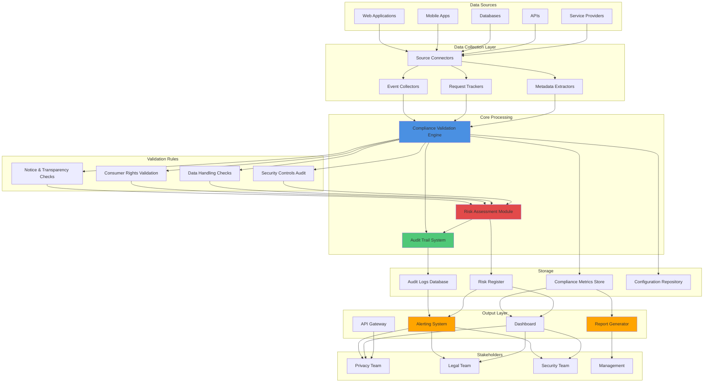
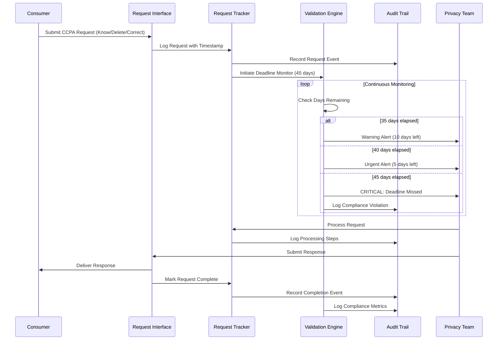
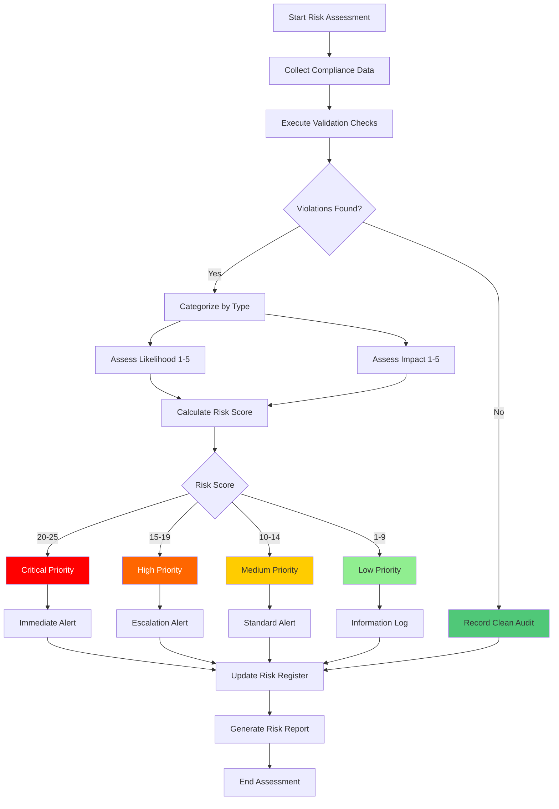
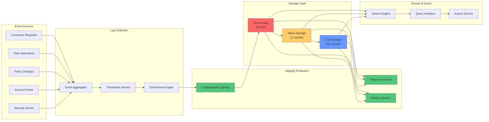
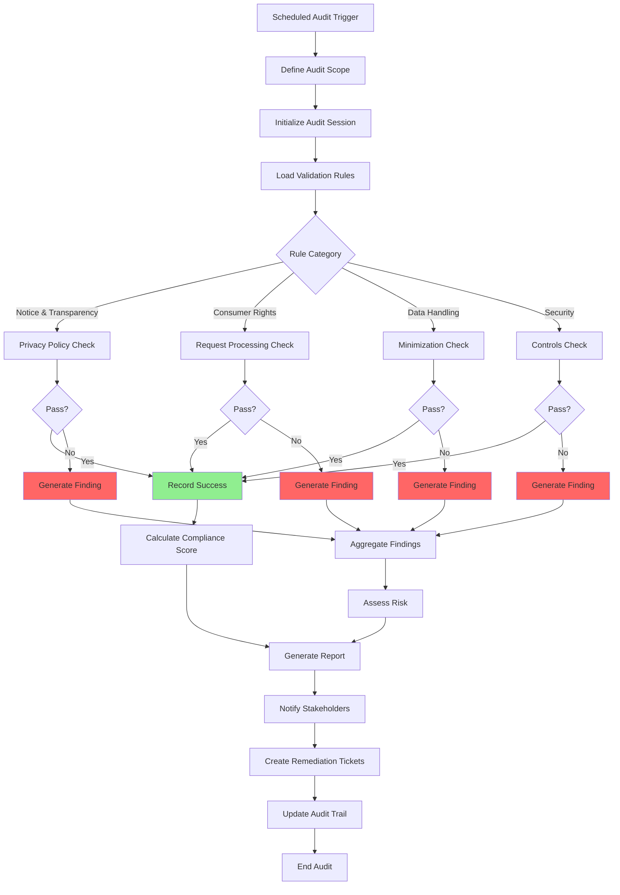
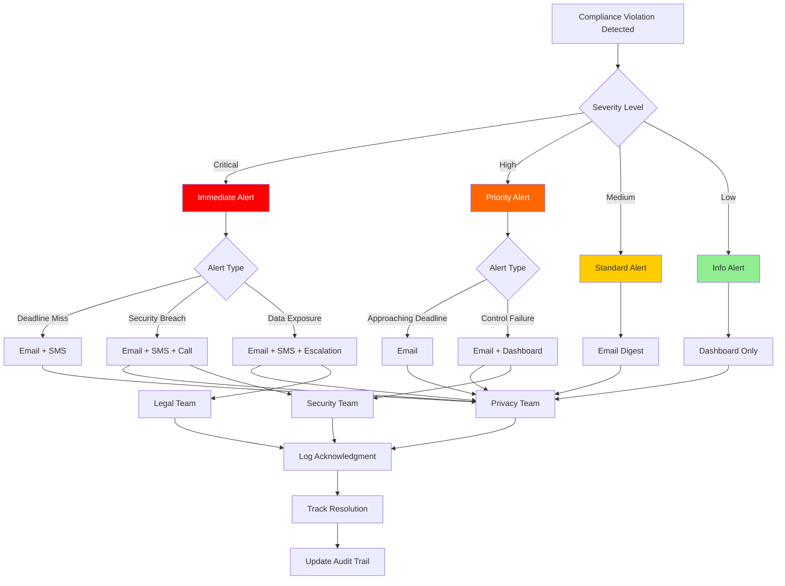
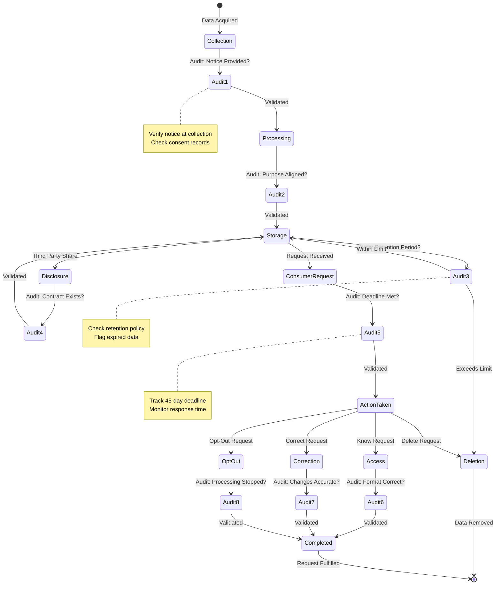
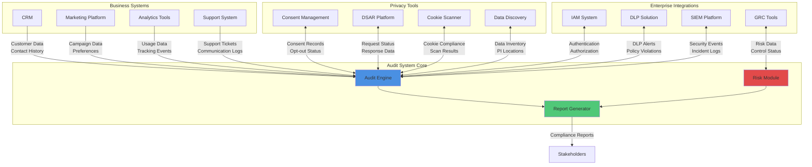
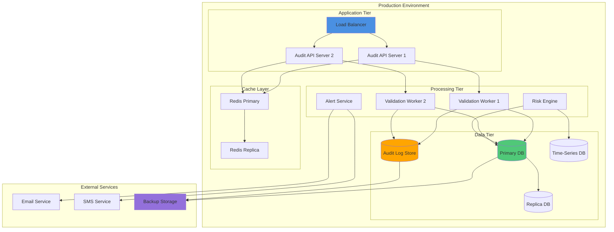

# CCPA Compliance Audit Architecture Diagram

This document contains visual diagrams of the CCPA compliance audit architecture using Mermaid syntax.

## System Architecture Diagram



## Consumer Request Processing Flow



## Risk Assessment Flow



## Audit Trail Architecture



## Compliance Validation Pipeline



## Alert Routing Diagram



## Data Lifecycle & Audit Points



## Integration Architecture



## Metrics Dashboard Layout

```mermaid
graph TB
    subgraph "Compliance Dashboard"
        A[Overall Compliance Score<br/>██████████ 95%]
        B[Open Findings: 12<br/>Critical: 2 | High: 5 | Medium: 5]
    end
    
    subgraph "Consumer Requests"
        C[This Month: 145<br/>Know: 80 | Delete: 45 | Correct: 20]
        D[Avg Response Time: 32 days<br/>On-Time Rate: 98%]
    end
    
    subgraph "Risk Overview"
        E[High-Risk Items: 7<br/>New This Week: 2]
        F[Mitigation Progress<br/>█████░░░░░ 50%]
    end
    
    subgraph "Recent Activity"
        G[Last Audit: 2 days ago<br/>Next Audit: 28 days]
        H[Recent Alerts: 5<br/>Unacknowledged: 1]
    end
    
    style A fill:#50c878
    style B fill:#ff6666
    style C fill:#4a90e2
    style D fill:#50c878
    style E fill:#ff6600
    style F fill:#ffcc00
```

## Deployment Architecture



## Notes on Diagrams

### Rendering
These diagrams use Mermaid syntax and can be rendered in:
- GitHub Markdown (native support)
- GitLab Markdown (native support)
- Documentation platforms (Docusaurus, MkDocs, etc.)
- VS Code with Mermaid extensions
- Online Mermaid editors

### Customization
To customize these diagrams:
1. Copy the Mermaid code block
2. Paste into a Mermaid editor
3. Modify colors, labels, or structure as needed
4. Export as PNG/SVG if needed for presentations

### Color Legend
- **Blue (#4a90e2)**: Core processing components
- **Red (#e24a4a / #ff6666)**: Risk and violations
- **Green (#50c878 / #90ee90)**: Success and compliance
- **Orange (#ffa500 / #ff6600)**: Warnings and alerts
- **Yellow (#ffcc00)**: Medium priority items
- **Purple (#9370db)**: External/backup systems
